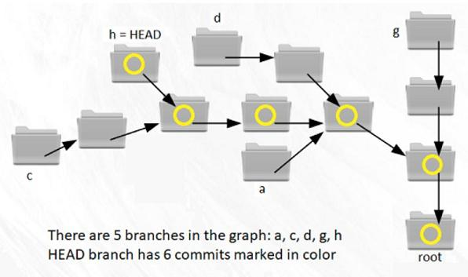

### GitObjects

The aim of this project is to access the objects in any Git repository from within Java.

There are only two source files -- explained in [the API](https://maeyler.github.io/GitObjects/)

Start with `$ java -jar sss.jar` and click on `Menu.chooser()` and then on `Chooser.runTeacher()`

Select GitInspector.txt in the File dialog and then select Git.class -- Here is the explanation of the events:

We need a new Git instance in the current directory: `G = new Git()`

First, display All Branches in G:  `G.getAllBranches()`



There are 13 branches in our repo. Find the HEAD branch in G:  `h = G.currentHEAD()`

Display All Commits in this branch:  `h.printAllCommits()`

HEAD branch has 21 commits in this repo


Find the last commit in h:  `c = h.getLatestCommit()`  This is a Git object of the first kind.

This object has all the information about the commit: 
* what: SHA and pointer to the Tree (contents)
* when: time in msec and as date string
* after: the parents (0, 1, or 2 SHA links)
* who: the author (name and e-mail)

Every Git object has also 5 pieces of information:
* Type: commit, tree, or blob (=binary file)
* SHA serves as a content-dependent name
* Human-readable name, need not be unique
* Size in bytes (uncompressed binary)
* Parent object -- either commit or tree


Load the tree of this Commit:  `t = c.getTree()`  This is a Git object of the second kind: the root directory.

Get the first child in the tree:  `b = t.getChildAt(0)`  This is a Git object of the third kind: a file.

Finally, make and display the tree:  `n = c.toTreeNode(); Menu.toTree(n);`


### Version History

#### V0. GitObjects.java

It all started with [an excellent article](https://hackernoon.com/https-medium-com-zspajich-understanding-git-data-model-95eb16cc99f5) on .git/objects -- I had to try it myself!

It worked fine, but the story is incomplete: Most Git objects are packed!


#### V1. GitInspector becomes Git.java

Rather than trying to unpack objects, Git should do the work -- use `java.lang.ProcessBuilder` 

**Usage:** Compile and run Git.java at the root of any Git repo

The output of the program on *this repo*, when it had only three commits:
````
$ java Git
88f4044ecf7f20aba666136072bd4f0132c28f0d
21/03/2018 17:18  GitObjects.java
tree 91ea30  4 items ***  parent e4f4d0
============================================================
21/03/2018 17:17  modify README
tree c9d0f5  2 items ***  parent 7bb2af
============================================================
21/03/2018 14:01  Initial commit
tree bcadff  1 items ***
============================================================
````

#### V2. verifiy() and saveTo(File)

We can verify every Blob within a Commit by calculating its SHA 

We can also save to the contents of each Commit into a given folder

#### V3. Objects are cached

Git objects are immutable -- Rather than calculating each object from scratch, we keep them in Map and avoid lengthy calculations

#### V4. TreeNode is separated from Git objects

TreeNode is a useful interface recognized by JTree, simplifing to display the contents of a given Commit.

In earlier versions, Git.Entry implements TreeNode. In V4, the two classes are separated.
